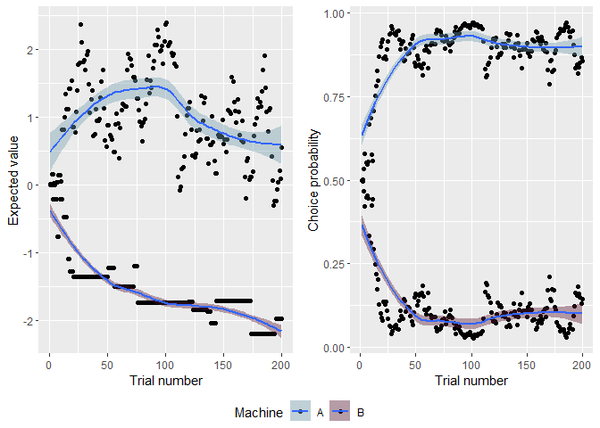
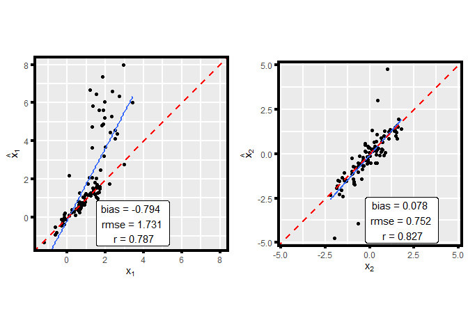
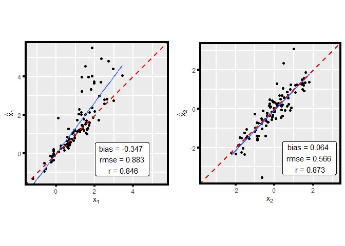
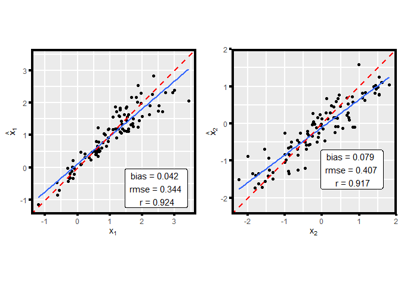

<!-- README.md is generated from README.Rmd. Please edit that file -->

# Modeling two-choice decision behavior in R

<!-- badges: start -->

<!-- badges: end -->

See [Suthaharan, P., Corlett, P.R., & Ang, Y.S. (2021). Computational
modeling of behavioral tasks: An illustration on a classic reinforcement
learning paradigm]() for more detail.

Questions? Contact Praveen Suthaharan (<praveen.suthaharan@yale.edu>).

—————

The goal of *twochoiceRL* is to guide users on how to simulate
two-choice decision behavior and then how to recover
the behavioral parameters that were used to simulate the
behavior.

## Installation

<!-- You can install the released version of twochoiceRL from [CRAN](https://CRAN.R-project.org) with: -->

<!-- ``` r -->

<!-- install.packages("twochoiceRL") -->

<!-- ``` -->

You can install the development version of *twochoiceRL* from
[GitHub](https://github.com/psuthaharan/twochoiceRL) with:

``` r
# install.packages("devtools")
devtools::install_github("psuthaharan/twochoiceRL")
```

## Simulation

Simulate behavior:

``` r
library(twochoiceRL)
# generate 100 individuals
# dataset1 contains behavioral data keeping only those selected-choice trials
dataset1 <- simulate_twochoiceRL(n_subj = 100, n_tr = 200, trials_unique = TRUE)

# dataset2 contains behavioral data keeping all trials (selected-choice and the non-selected-choice)
dataset2 <- simulate_twochoiceRL(n_subj = 100, n_tr = 200, trials_unique = FALSE)
```

## Visualization

Plot behavior:

``` r
# for plotting purpose - let's use dataset2
# You randomly select a participant to observe his/her behavior

# View first 10 rows of individual 100's data
head(dataset2$twochoiceRL[[100]],10)
#>    Trial        Value        Pr Option Action      Reward
#> 1      1  0.011472946 0.5000000      1      1  0.07437611
#> 2      1  0.000000000 0.5000000      2      1  0.07437611
#> 3      2  0.150651408 0.5024829      1      1  0.91373052
#> 4      2  0.000000000 0.4975171      2      1  0.91373052
#> 5      3  0.150651408 0.5325572      1      2 -1.39233659
#> 6      3 -0.214775990 0.4674428      2      2 -1.39233659
#> 7      4  0.028651131 0.5784314      1      1 -0.64024449
#> 8      4 -0.214775990 0.4215686      2      1 -0.64024449
#> 9      5 -0.001389443 0.5524874      1      1 -0.16609406
#> 10     5 -0.214775990 0.4475126      2      1 -0.16609406


# Visualize behavior 
p1 <- plot_twochoiceRL(data = dataset2, subj = 100, colors = c("#009999","#0000FF"))

# View expected value AND choice probability
p1[[3]]
```



``` r

# Visualize choice probability - animated 
plot_twochoiceRL(data = dataset2, subj = 100, colors = c("#009999","#0000FF"), plot_type = "animate")
```


## Estimation

Estimate behavioral parameters from simulated data:

``` r
# Run MLE (elapsed time: ~ 5 min)
est_mle <- estimate_twochoiceRL(data = dataset1,
                                method = "mle",
                                plot = TRUE)
est_mle[[4]] # return MLE-estimation plot
```



``` r

# Run MAP (elapsed time: ~ 5 min)
est_map <- estimate_twochoiceRL(data = dataset1,
                                method = "map",
                                prior_mean = c(0,0),
                                prior_sd = c(5,5),
                                plot = TRUE)
est_map[[4]] # return MAP-estimation plot
```



``` r

# Run EML (elapsed time: ~ 1.4 hours)
est_eml <- estimate_twochoiceRL(data = dataset1,
                                method = "eml",
                                prior_mean = c(0,0),
                                prior_sd = c(5,5),
                                plot = TRUE)
est_eml[[4]] # return EML-estimation plot
```



Visualize the posterior hyperparameters per EML-iteration:

``` r
# Laplace-approximated posterior hyperparameters
# for x1 AND x2
est_eml[[7]]
```


``` r

# x1, animated
est_eml[[8]]
```


